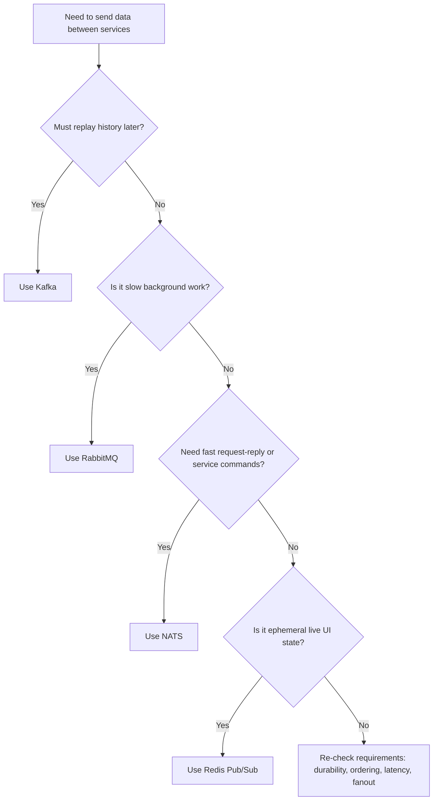
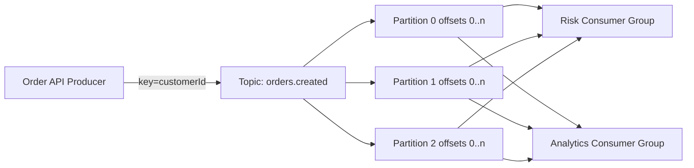
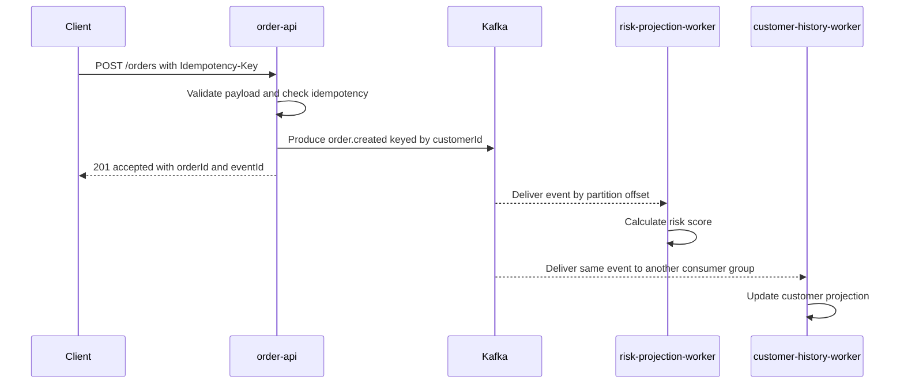
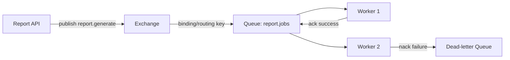
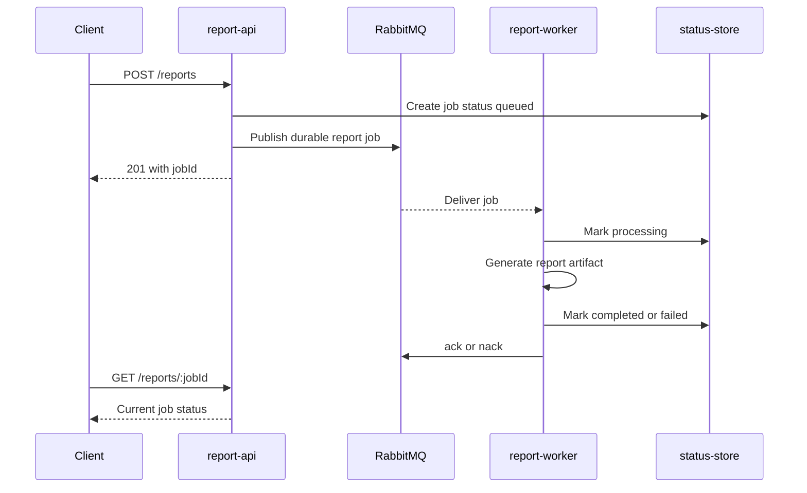
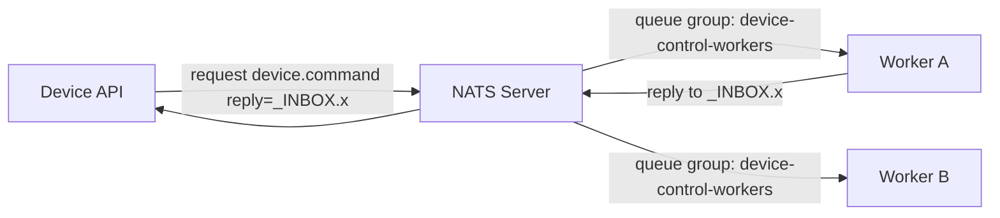
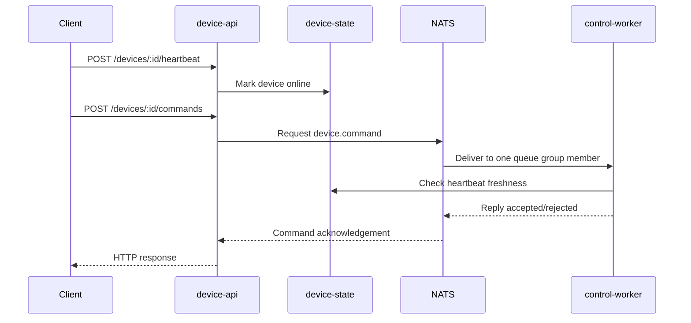
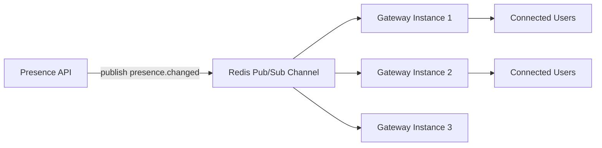
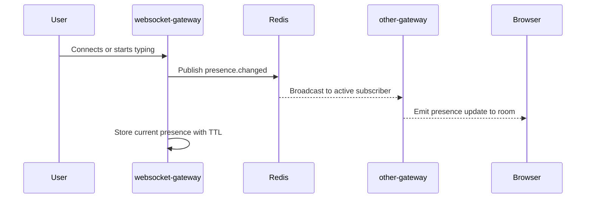

# Broker Internals And Production Guide

This guide explains Kafka, RabbitMQ, NATS, and Redis Pub/Sub in engineering terms, but without unnecessary academic language. The goal is to understand what each broker is internally, what problem it solves, how production systems use it, and how this codebase maps to real-world patterns.

## Simple Mental Models

| Broker | Easy Mental Model | What It Optimizes For |
| --- | --- | --- |
| Kafka | A durable commit log split into partitions. Consumers remember offsets. | Replayable event history, ordered streams, analytics, projections. |
| RabbitMQ | A smart message router with durable mailboxes. Workers ack messages when done. | Background jobs, task queues, retries, back-pressure. |
| NATS | A fast nervous system for services. Subjects route messages with very low overhead. | Low-latency request-reply, service commands, lightweight fanout. |
| Redis Pub/Sub | A radio broadcast tower. Active listeners hear messages; offline listeners miss them. | Ephemeral live updates like presence and typing indicators. |

## Choosing The Right Broker

## Kafka Internals

Kafka is not mainly a queue. Kafka is a distributed append-only log.

Producers append records to topics. Topics are split into partitions. Each partition is an ordered log. Consumers read records by offset and store their progress. Kafka keeps data for a configured retention period, so consumers can replay old events.

### Key Internal Concepts

| Concept | Meaning |
| --- | --- |
| Topic | Named stream of records, for example `orders.created`. |
| Partition | Ordered shard of a topic. Kafka ordering is guaranteed inside a partition, not across the whole topic. |
| Offset | Record position inside a partition. Consumers commit offsets to track progress. |
| Message key | Determines which partition gets the record. Same key usually means same partition, preserving order for that key. |
| Consumer group | A group of consumers sharing work. Each partition is consumed by only one member of a group at a time. |
| Retention | Kafka keeps records after consumption. Consumption does not delete messages. |
| Replay | A consumer can reset offsets and rebuild projections from old events. |

### Kafka Production Flow

### Problems Kafka Solves

Kafka is good when the event itself is valuable.

Use Kafka for:

| Problem | Why Kafka Fits |
| --- | --- |
| Order lifecycle events | Every order event is a business fact worth retaining. |
| Audit trails | Events can be replayed and inspected later. |
| Analytics pipelines | Many independent consumers can process the same stream. |
| Event-sourced projections | New projections can replay old events to build state. |
| Per-customer ordering | Key by `customerId` so that one customer's events stay ordered. |

Avoid Kafka when:

| Problem | Better Fit |
| --- | --- |
| Simple job queue | RabbitMQ is usually simpler. |
| Ultra-low-latency commands | NATS is usually lighter. |
| Disposable UI hints | Redis Pub/Sub is simpler. |

### Kafka Failure Modes In Production

| Failure | Production Handling |
| --- | --- |
| Producer retries create duplicates | Use idempotency keys and idempotent consumers. |
| Consumer crashes after side effect but before offset commit | Make consumers idempotent and store processed event IDs. |
| Bad event payload | Use schema validation and route to a dead-letter topic. |
| Slow consumer | Monitor consumer lag. Scale consumers or optimize processing. |
| Hot partition | Pick a better key or add partitioning strategy. |

### How This Codebase Uses Kafka

| Feature | Location | Production Idea Demonstrated |
| --- | --- | --- |
| Idempotency key | `kafka-order-stream/src/orders.service.ts` | Prevents duplicate HTTP retries from producing duplicate events. |
| Message key | `customerId` | Keeps events for one customer ordered. |
| Event envelope | `OrderCreatedEvent` | Adds `eventType`, `schemaVersion`, IDs, and correlation ID. |
| Consumer projection | `OrderProjectionStore` | Demonstrates building query state from a stream. |
| Projection endpoints | `/customers/:customerId/projection`, `/projections` | Shows how stream consumers feed read models. |

## RabbitMQ Internals

RabbitMQ is a message broker built around exchanges, queues, bindings, and acknowledgements.

The producer usually does not publish directly to a queue. It publishes to an exchange with a routing key. The exchange routes the message to one or more queues based on bindings. Workers consume from queues and acknowledge messages when work is done.

### Key Internal Concepts

| Concept | Meaning |
| --- | --- |
| Exchange | Receives producer messages and routes them. |
| Queue | Stores messages until consumers process them. |
| Binding | Rule connecting an exchange to a queue. |
| Routing key | Value used by exchanges to decide where a message goes. |
| Ack | Worker tells RabbitMQ the message was processed successfully. |
| Nack | Worker tells RabbitMQ processing failed. Message can be requeued or dead-lettered. |
| Prefetch | Limits how many unacked messages a worker can hold. This is back-pressure. |
| Dead-letter queue | Queue for messages that failed permanently or exceeded retry limits. |

### RabbitMQ Production Flow

### Problems RabbitMQ Solves

RabbitMQ is good when work needs to happen later, possibly by a pool of workers.

Use RabbitMQ for:

| Problem | Why RabbitMQ Fits |
| --- | --- |
| Report generation | Slow work should not block HTTP. |
| Email sending | Worker can retry failures. |
| Image/video processing | Queue smooths spikes and controls concurrency. |
| Integrations with flaky third parties | Retry and dead-letter failed jobs. |
| Workload back-pressure | Prefetch prevents workers from taking too much work. |

Avoid RabbitMQ when:

| Problem | Better Fit |
| --- | --- |
| Replayable event history | Kafka is better. |
| Very high-throughput analytics stream | Kafka is usually better. |
| Ultra-light service commands | NATS is simpler. |

### RabbitMQ Failure Modes In Production

| Failure | Production Handling |
| --- | --- |
| Worker crashes mid-job | Message remains unacked and is redelivered. Make job processing idempotent. |
| Poison message fails forever | Use retry limit and dead-letter queue. |
| Queue grows too large | Scale workers, add rate limits, or reject upstream traffic. |
| Worker overload | Tune `prefetchCount`. |
| Broker restart | Use durable queues and persistent messages. |

### How This Codebase Uses RabbitMQ

| Feature | Location | Production Idea Demonstrated |
| --- | --- | --- |
| Durable job queue | `REPORT_QUEUE=report.jobs` | API creates work that a worker processes later. |
| Manual ack/nack | `reports.worker.ts` | Worker controls success/failure acknowledgement. |
| Prefetch 1 | `main.ts` | Demonstrates back-pressure. |
| Job status store | `ReportJobsStore` | Tracks queued, processing, completed, and failed states. |
| Simulated failure | `simulateFailure: true` | Shows failure status and nack behavior. |
| Status endpoints | `/reports`, `/reports/:jobId` | Production APIs usually expose job state. |

## NATS Internals

NATS is a high-speed subject-based messaging system. Core NATS does not store messages. It routes messages to subscribers that are currently interested.

NATS supports request-reply by creating a temporary inbox subject. The requester sends a message with a reply subject, and the responder publishes the answer to that reply subject.

### Key Internal Concepts

| Concept | Meaning |
| --- | --- |
| Subject | Address for messages, for example `device.command`. |
| Subscriber | Service listening to a subject. |
| Queue group | Multiple subscribers share load. One message goes to one group member. |
| Request-reply | Requester sends a message with a reply inbox subject. |
| Core NATS | Fast, ephemeral messaging without persistence. |
| JetStream | NATS persistence layer for durable streams and consumers. |

### NATS Production Flow

### Problems NATS Solves

NATS is good when services need quick communication and low operational overhead.

Use NATS for:

| Problem | Why NATS Fits |
| --- | --- |
| Device commands | Request-reply gives fast acknowledgement. |
| Internal control plane | Low latency and simple subjects. |
| Service mesh messaging | Queue groups spread work. |
| Live telemetry fanout | Lightweight event distribution. |

Avoid core NATS when:

| Problem | Better Fit |
| --- | --- |
| Must replay history | Kafka or NATS JetStream. |
| Long-running durable jobs | RabbitMQ. |
| Must guarantee offline delivery without JetStream | Kafka, RabbitMQ, or JetStream. |

### NATS Failure Modes In Production

| Failure | Production Handling |
| --- | --- |
| No responder online | Request times out. Return a clear `503` or fallback. |
| Responder slow | Tune command timeout and monitor latency. |
| Message needed later | Use JetStream instead of core NATS. |
| Device state stale | Gate commands using heartbeat freshness. |
| Too many subscribers | Use queue groups to load balance. |

### How This Codebase Uses NATS

| Feature | Location | Production Idea Demonstrated |
| --- | --- | --- |
| Heartbeat state | `DevicesRegistry` | Commands are rejected if a device has no fresh heartbeat. |
| Request-reply commands | `/devices/:deviceId/commands` | API waits for a fast command acknowledgement. |
| Queue group | `device-control-workers` | Multiple workers could share command traffic. |
| Telemetry fanout | `/devices/:deviceId/telemetry` | Events are broadcast to active subscribers. |
| State endpoints | `/devices`, `/devices/:deviceId` | Shows current control-plane state. |

## Redis Pub/Sub Internals

Redis Pub/Sub is simple. A publisher sends a message to a channel. Redis immediately forwards it to currently subscribed clients. Redis does not persist the message and does not retry it later.

### Key Internal Concepts

| Concept | Meaning |
| --- | --- |
| Channel | Pub/Sub topic name, for example `presence.changed`. |
| Publisher | Client that broadcasts a message. |
| Subscriber | Active client listening to a channel. |
| Ephemeral delivery | Messages are delivered only to currently connected subscribers. |
| No offsets | Subscribers do not track durable progress. |
| No replay | Missed messages are gone. |

### Redis Pub/Sub Production Flow

### Problems Redis Pub/Sub Solves

Redis Pub/Sub is good for live hints where missing an event is acceptable.

Use Redis Pub/Sub for:

| Problem | Why Redis Pub/Sub Fits |
| --- | --- |
| Online/offline badges | Latest state matters more than every historical transition. |
| Typing indicators | Disposable by nature. |
| WebSocket gateway fanout | Active gateway instances need immediate notification. |
| Cache invalidation hints | If missed, TTL or later reads can recover. |

Avoid Redis Pub/Sub when:

| Problem | Better Fit |
| --- | --- |
| Payment events | Kafka or RabbitMQ. |
| Background jobs | RabbitMQ or BullMQ. |
| Replayable event history | Kafka or Redis Streams. |
| Guaranteed offline delivery | RabbitMQ, Kafka, Redis Streams, or NATS JetStream. |

### Redis Pub/Sub Failure Modes In Production

| Failure | Production Handling |
| --- | --- |
| Subscriber offline | Accept loss, or use Redis Streams if loss is not acceptable. |
| Redis restart | Pub/Sub messages in flight are lost. Store current state separately. |
| UI needs latest state | Store current presence keys with TTL. |
| Large fanout | Use room-level channels or gateway routing. |
| Startup DNS delay | Configure retry attempts and retry delay. |

### How This Codebase Uses Redis Pub/Sub

| Feature | Location | Production Idea Demonstrated |
| --- | --- | --- |
| Ephemeral events | `/presence` | Broadcasts online, typing, away, and offline updates. |
| Current state store | `PresenceStore` | Keeps queryable current state with TTL-like expiry. |
| Room lookup | `/rooms/:roomId/presence` | Mimics WebSocket room fanout state. |
| Startup retries | `REDIS_RETRY_ATTEMPTS`, `REDIS_RETRY_DELAY_MS` | Handles Docker DNS/Redis startup timing. |

## What This Project Simulates From Production

| Production Concern | Kafka | RabbitMQ | NATS | Redis Pub/Sub |
| --- | --- | --- | --- | --- |
| Correlation IDs | Yes | Yes | Yes | Yes |
| Structured JSON logs | Yes | Yes | Yes | Yes |
| Input validation | Yes | Yes | Yes | Yes |
| Idempotency | HTTP order idempotency key | Job IDs | Command IDs | Event IDs |
| Current read model | Postgres customer projection | Postgres job status store | Postgres device registry | Postgres presence store |
| Failure path | High-risk warning | Simulated failed job | Rejected stale command | Offline cleanup |
| Broker metadata logs | Partition/offset | Delivery tag/redelivery | Command latency | Channel/event fanout |

## What Real Production Still Needs

This project intentionally stays small enough to study. A real production system should also add:

| Area | Production Addition |
| --- | --- |
| Persistence | This demo now uses Postgres; production still needs migrations, backups, PITR, retention policies, and HA. |
| Auth | JWT, mTLS, API keys, or service-to-service identity. |
| Metrics | Prometheus counters/histograms for latency, failures, lag, queue depth, and retries. |
| Tracing | OpenTelemetry spans across HTTP, broker publish, and broker consume. |
| Schemas | JSON Schema, Avro, Protobuf, or AsyncAPI contracts. |
| Retries | Retry topics, retry exchanges, backoff, and dead-letter queues. |
| Deployment | Kubernetes, readiness/liveness probes, resource limits, and autoscaling. |
| Secrets | Docker/Kubernetes secrets instead of plain environment variables. |
| Security | Network policies, broker authentication, TLS, and authorization. |

## One-Line Summary

Use Kafka when history matters, RabbitMQ when work must be done reliably later, NATS when services need fast conversations, and Redis Pub/Sub when live updates are disposable.
